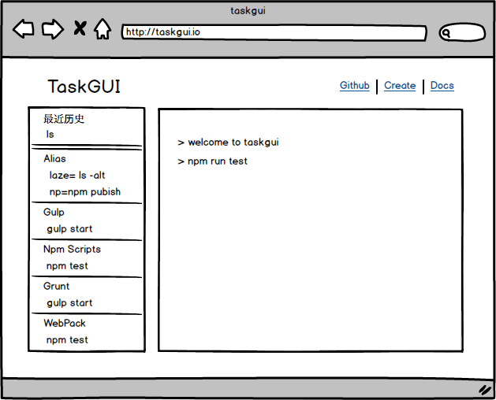

# taskgui

a cli tool for task gui in browser (npm scripts、gulp、grunt、webpack)

[Design](docs/design.md) | [Guide](docs/guide.md) | [Plugins](docs/plugin.md) | [Api](docs/api.md)



## Features

- [x] build-in support npm script && gulp && grunt tasks
- [x] command + k : clear sh history
- [ ] auto detect task with tg-plugin-xxx

## Install

    [sudo]npm install -g taskgui
    
avaiable cli command

- taskgui
- tg

## Usage 

```
$ tg
```

## Start a project

```
$ npm init -y
$ tg
```

then open in browser

http://127.0.0.1:7878/

## Contributing

1. Fork it
2. Create your feature branch (`git checkout -b my-new-feature`)
3. Commit your changes (`git commit -am 'Add some feature'`)
4. Push to the branch (`git push origin my-new-feature`)
5. Create new Pull Request

## 版本历史

- v1.0.0 初始化版本cli

## 欢迎fork和反馈

- write by `i5ting` i5ting@126.com

如有建议或意见，请在issue提问或邮件

## License

this repo is released under the [MIT
License](http://www.opensource.org/licenses/MIT).
